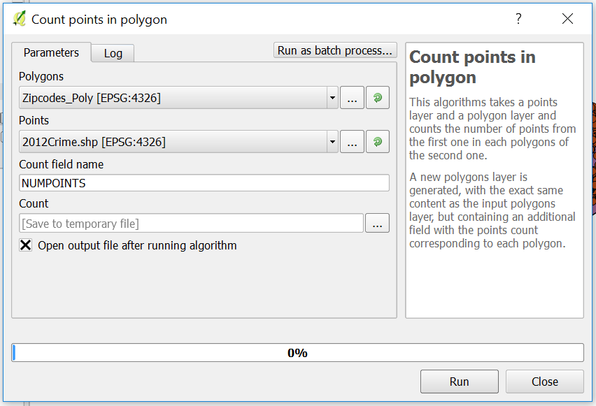
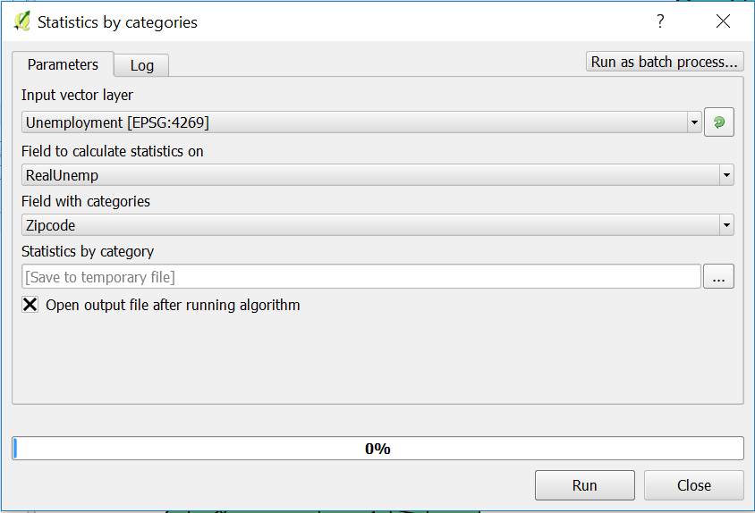
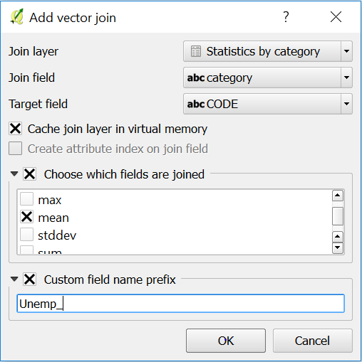

# Expressing Bivariates without Diagrams
------------------------------------------

Lab by: Amie Devlin, Elisa Hernandez and Jess Bradley

# Overview

 - Create a map of two variables
 - Learn to Geocode with lat/long using MMQGIS

These objectives will be met through the creation of a bivariate choropleth map. In this lab, the variables being mapped are:

- Violent Crime by ZIP Code
- Unemployment Rate by ZIP Code

This map will help analyze whether there is a link between areas of high unemployment and areas with a high rate of violent crimes.  

# Data Files

For this lab, the following data files are needed and can be found here
[http://bit.ly/2dHGs1q]:

* As a separate attribute table
    * `2012Crime.csv`
* All 3 layers listed below will be included in a spatial database called LabDB.sqlite:
    * `Philly_Census_Tract`

    * `Unemployment`

    * `Zipcodes_Poly`

### Geoding 2012 Crime Data with MMQGIS

To begin, add the following files to the viewer window:
	
Zipcodes_Poly and Philly_Census_Tract using Add Vector Layer on the thumbnail panel on the left side of the window. An alternative and much easier way to do this is to find the files in Browser Panel and drag them into the viewing window.

You will need to install "MMQGIS" plugin. This will be used to geocode the crime data for Philadelphia. To do this, select `Plugins` and then click on `Manage and Install Plugins`. You will now see MMQGIS in your menu bar.

>Note: It is highly recommended that you visit [http://michaelminn.com/linux/mmqgis/] to learn how to do more cool stuff beyond lat long geocoding.

To geocode the crime data 2012Crime.csv, click on `MMQGIS` in the menu bar and then `Import/Export`. You will then see an option called `Geometry Import from CSV file`, click that. Save output file name in a location that you can access. 

>For these settings, you want to select:
>:      Longitude Column = Longitude
>:      Latitude Column = Latitude
>:      Shape ID Column = ID
>:      Geometry Type = Point

This creates a point layer of violent crimes. Next, you will need to create a count of all violent crimes in each zip code which will output a polygon layer.  

To create the count, go to the `Processing toolbox`.  This may already be loaded on the right hand side of the screen.  If it is not, select `Processing` from the menu bar and click `toolbox`. From there select `QGIS Geoalgorithms`, `Vector analysis tools` and then finally `Count points to polygon`. If you are having trouble finding this tool, utilize the search bar at the top of `Processing toolbox`. 

>For the settings, you want to select:
>:		Polygons = Zipcodes_Poly
>:      Points = 2012Crime.shp
>:      Count Field Name = NUMPOINTS

Click `Run`.  This will create a new layer called Count.  

>Note: This new layer (Count) is not automatically saved.  If you want to save this layer, and it is recommended that you do, you should right-click on the layer name and `Save As...`.

For now, we will put this layer aside and move onto the unemployment data.  We will return to the crime data at the end when discussing symbology.  

### Unemployment Rate in Philadelphia by ZIP code

>Note: For this portion of the exercise, we will be analyzing data on the zip code level instead of the census tract level.  ZCTA (Zip Code Tabulation Area) data is provided every 10 years just like the decennial data. Because of the data being available in bulk only, focusing on a particular year like 2012, can prove to be difficult. 
For our final project, our group is doing an analysis at the zip code level due to the provided data from PHMC Community Health Assessment (one of our variables), which collected data at the zip code level as opposed to the census tract level.  We decided to include this portion of our analysis in the lab to demonstrate that there is a way to work with data with different boundaries (ie zip codes and census tract) to create one layer. If you want to read more about ZCTA's or download ZCTA data, click [https://www.census.gov/geo/reference/zctas.html]. 

For this portion of the lab, we will use the following files: 

* `Zipcodes_Poly`
* `Unemployment`

Make sure that both of these have been added to the viewer window.  

The unemployment rate (Unemp_Rate) field type is currently string.  In order for us to statistically analyze this field, it will need to be converted into a numerical format.  Similar to previous labs, this can be done using `Field Calculator` and the function `to_real()` within the `Conversions` tab.   When converting the field, be sure to select `decimal number (real)` as the Output field type.  For more information, refer to Lab 2.  Save the new numeric variable as "RealUnemp".  

The unemployment rate data is currently on census tract level and we need it On zip code level. This means we have to find the avg of the census tract rate within the zip codes. 

>- This will be done by performing `Statistics by Category`.  For more information, review Lab 3.  Please see the picture below:

The previous calculation will result us a new table called Statistics by Category.  Join the new table to the Zipcodes_Poly layer. 

>Note: This table produces a number of statistics but you will only need the mean field for finishing this lab.

When joining the newly formed **mean** field, QGIS converted the field to a string type.  We will need to again use the `to_real()` function to convert this into a numeric value.  Name this new variable RealMean.  Follow the same instructions as previously stated above.

Now you have completed all the analyses required for both layers.

### Symbology

To understand visually the relationship between unemployment rate and crime, we need to create a choropleth for each layer.  This can seem complicated as most would assume that you would use colors.  However, GIS allows you to fill with crosshatching instead of a solid color fill.  
 

## Assignment
-------------------------------------

Create a choropleth map showing both unemployment rate and crime.  Show unemployment rate using a solid color fill.  Show crime with crosshatching.  

### How to cross hatch:   

Open Layer Properties for Count (or whatever name you selected for the crime polygon) created in the first portion of the lab.

In `Style`, under `Single Symbol`,  select `Simple Fill`.  In Symbol layer type, click on the drop-down menu for `Fill style`.  Instead of Solid, we are selecting `Diagonal X`.  Select `Apply`.

Still in `Style`, select Graduated instead of Single Symbol. For Column, select NUMPOINTS and continue creating a choropleth layer as done in previous labs.  

The results should show a crosshatching graduated symbol instead of a graduated solid color fill.  

>Note: Be careful about choosing color schemes here.  You want to communicate that there may be areas that have both high unemployment and high crime.  If you choose colors that do not contrast, these areas may not be highlighted appropriately.  Please see http://colorbrewer2.org/ for ideas on diverging color schemes.  

#### Example

